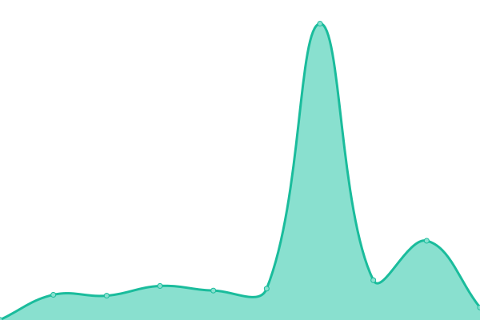
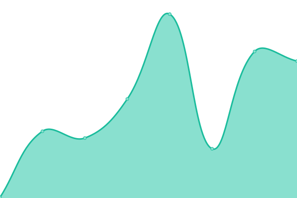

# [📈 Live Status](https://status.matters.news/): <!--live status--> **🟧 Partial outage**

This repository contains the open-source uptime monitor and status page for [Upptime](https://upptime.js.org), powered by [Upptime](https://github.com/upptime/upptime).

With [Upptime](https://upptime.js.org), you can get your own unlimited and free uptime monitor and status page, powered entirely by a GitHub repository. We use [Issues](https://github.com/upptime/upptime/issues) as incident reports, [Actions](https://github.com/thematters/uptime/actions) as uptime monitors, and [Pages](https://upptime.github.io/upptime) for the status page.

<!--start: status pages-->
<!-- This summary is generated by Upptime (https://github.com/upptime/upptime) -->
<!-- Do not edit this manually, your changes will be overwritten -->
<!-- prettier-ignore -->
| URL | Status | History | Response Time | Uptime |
| --- | ------ | ------- | ------------- | ------ |
|  [Matters (matters.news)](https://matters.news/) | 🟥 Down | [matters-matters-news.yml](https://github.com/thematters/uptime/commits/HEAD/history/matters-matters-news.yml) | 

 3312ms
     
 | 

<a href="https://status.matters.news/history/matters-matters-news">91.01%</a>
    

|  [Matters (API)](https://server.matters.news/playground) | 🟩 Up | [matters-api.yml](https://github.com/thematters/uptime/commits/HEAD/history/matters-api.yml) | 

 428ms
     
 | 

<a href="https://status.matters.news/history/matters-api">100.00%</a>
    

|  [Matters (IPFS)](https://ipfs.io/ipfs/QmNXVLMMLEq8XHtErBh3NFBetGt29wD7V2aXDp29Q4Lo4C) | 🟩 Up | [matters-ipfs.yml](https://github.com/thematters/uptime/commits/HEAD/history/matters-ipfs.yml) | 

 155ms
     
 | 

<a href="https://status.matters.news/history/matters-ipfs">99.15%</a>
    

|  [Matters (Landing Page)](http://matters-lab.io/) | 🟩 Up | [matters-landing-page.yml](https://github.com/thematters/uptime/commits/HEAD/history/matters-landing-page.yml) | 

 174ms
     
 | 

<a href="https://status.matters.news/history/matters-landing-page">100.00%</a>
    

|  [The Space (Landing Page)](https://www.thespace.game/) | 🟩 Up | [the-space-landing-page.yml](https://github.com/thematters/uptime/commits/HEAD/history/the-space-landing-page.yml) | 

 798ms
     
 | 

<a href="https://status.matters.news/history/the-space-landing-page">100.00%</a>
    

|  [The Space (App)](https://app.thespace.game/) | 🟩 Up | [the-space-app.yml](https://github.com/thematters/uptime/commits/HEAD/history/the-space-app.yml) | 

 970ms
     
 | 

<a href="https://status.matters.news/history/the-space-app">100.00%</a>
    

<!--end: status pages-->

[**Visit our status website →**](https://upptime.github.io/upptime)

## 📄 License

- Powered by: [Upptime](https://github.com/upptime/upptime)
- Code: [MIT](./LICENSE) © [Upptime](https://upptime.js.org)
- Data in the `./history` directory: [Open Database License](https://opendatacommons.org/licenses/odbl/1-0/)
